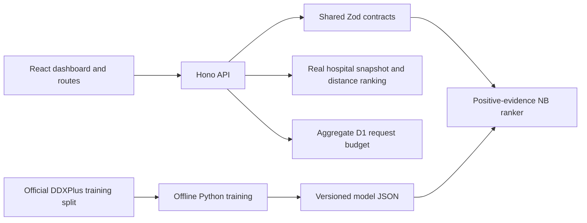

# Architecture

The five frontend screens use hash routes so refresh/deep linking works with Node and Worker static adapters. Assessment data is in React memory, not localStorage, a user database or URLs. Changing inputs clears stale results. A reload clears the current assessment.

The Hono backend serves metadata, the hospital directory and predictions using strict shared schemas. The exported model contains plain numeric parameters; no user-supplied pickle/code is evaluated. Positive-only inference treats unselected symptoms as unknown. The separately sourced hospital directory is ranked by distance without disease-to-service claims.

Worker mode shares one aggregate request counter through D1. Node mode uses an in-memory fallback. The database contains no health data or visitor identifiers. Neither runtime requires another portfolio project. The CPU and diabetes apps remain independent repositories and deployments.
