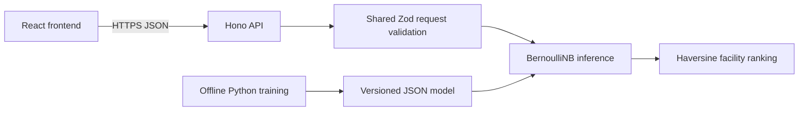

# Architecture

The frontend owns form state, empty/loading/error states and result presentation. It never trains a model or loads Python. The API owns validation, classification, distance ranking and response serialization. Both use shared TypeScript contracts.

Training lives in `ml/` and exports plain numeric arrays, rather than loading executable pickle files from clients. The generated model identifier is derived from the model parameters. The dataset digest and runtime versions are recorded alongside evaluation results. The API artifact is bundled at build time, so visitors cannot select arbitrary models or submit code.

Deployment adapters are deliberately thin. `worker.ts` serves the API and delegates static assets to the hosting binding. `local.ts` supplies a Node server and static frontend hosting, with graceful termination and request timeouts. There are no cross-project imports or calls to the other portfolio apps.

A D1 table stores one aggregate request-budget counter for the hosted Worker. It contains no visitor identifiers, symptoms or coordinates. Node mode retains an in-memory fallback. No authentication or prediction-record database is added because this is a public demonstration without user accounts or saved records. Introducing accounts or medical records would require a new data, authorization and privacy design rather than treating this demo as an existing patient system.
